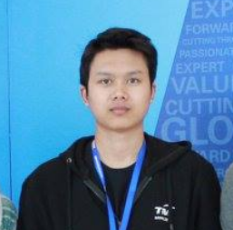

## About Me

Hi! I am Fakhri. I work as a Security Engineer.

## Research Interest

I enjoy doing reverse engineering and vulnerability research.

## Malware Research

Date | MD5
---- | ----
18 Jul 2018 | [4ec4f1ec6a030c4969bd336258f6699e](4ec4f1ec6a030c4969bd336258f6699e.md)
14 Aug 2018 | [08c6ac693d5d43fb8dec0451fe413e34](08c6ac693d5d43fb8dec0451fe413e34.md)

## Vulnerability Research

CVE | Description
-----|--------
CVE-2018-12327 | [ntpq and ntpdc 4.2.8p11 Local Buffer Overflow](CVE-2018-12327.md)
CVE-2018-12617 | [QEMU Guest Agent Denial of Service](CVE-2018-12617.md)
CVE-2018-12326 | [Redis-cli Buffer Overflow](CVE-2018-12326.md)
CVE-2018-12453 | [Redis 5.0 Denial of Service](CVE-2018-12453.md)
CVE-2018-13441 | [Nagios Core qh_help Denial of Service](CVE-2018-13441.md)
CVE-2018-13457 | [Nagios Core qh_echo Denial of Service](CVE-2018-13457.md)
CVE-2018-13458 | [Nagios Core qh_core Denial of Service](CVE-2018-13458.md)
CVE-2018-15887 | [ASUS DSL-N12E_C1 Auth Remote Command Execution](CVE-2018-15887.md)
NA               | [SIPp 3.6 Local Buffer Overflow](sipp_3.6.md)

## Contact

* Email: [mohdfakhrizulkifli@gmail.com](mailto:mohdfakhrizulkifli@gmail.com)
* Twitter: [Fakhri Zulkifli](https://twitter.com/d0lph1n98)
